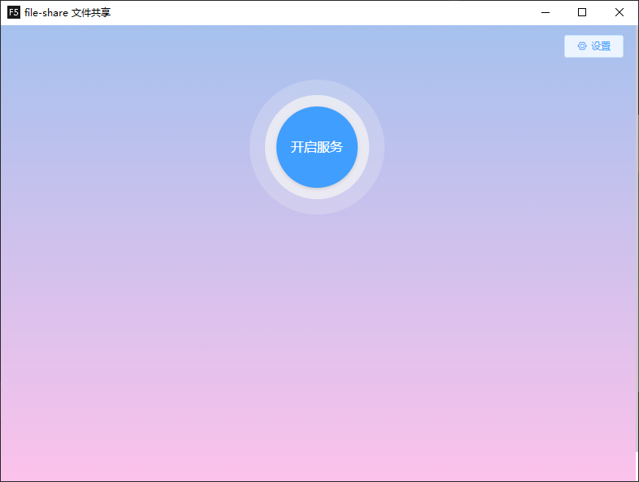
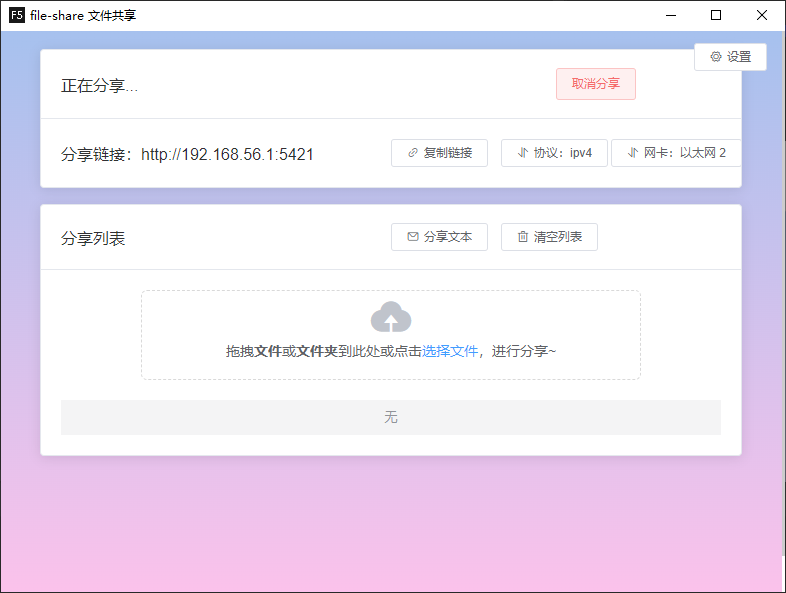
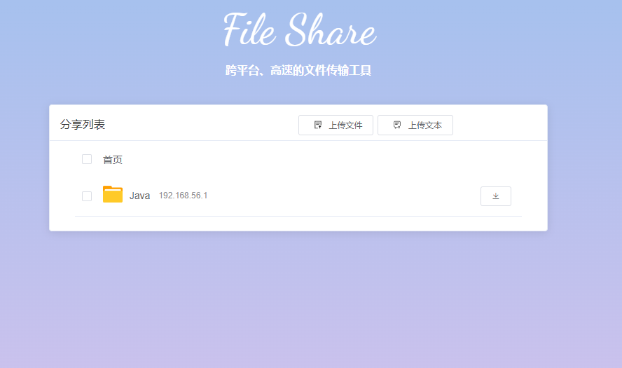

## 简介
### 经历过500M以上的大文件传输吗？紧急要用，然后文件传输要N小时！
### 经历过跨平台的文件传输的痛苦吗？你的mac电脑要传一个大文件给同事的windows电脑，过程一言难尽....
### file-share的诞生就是终结这个噩梦！

#### 优点
下载速度：带宽直接打满，支持断点续传，结合Neat Download Manager、Free Download Manager之类的多线程下载器，下载速度完全取决于你的路由器和电脑有多强，下载速度就有多快！

跨平台：支持Windows，MacOS，Linux等，Android，IOS等移动端可以通过网页上传或下载文件

安全隐私：本服务基于本地共享，代码开源，源码开放随便看！

## 开源地址：
https://gitee.com/yuDeJiJie/file-share-desktop

## 开始界面

## 主界面

## 下载界面

